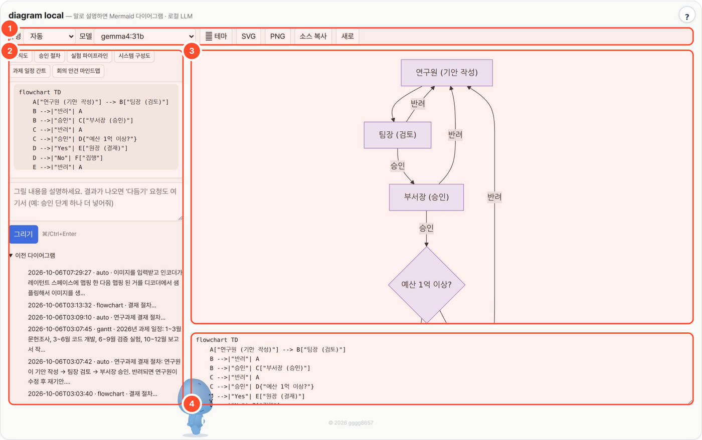

# diagram-local — 말로 설명하면 다이어그램 (Mermaid · 로컬 LLM)

업무 흐름이나 구조를 한국어로 설명하면 로컬 LLM이 Mermaid 소스를 쓰고, 브라우저가 바로 그림으로 그립니다. 소스를 직접 고치거나 대화로 다듬은 뒤 SVG·PNG로 내려받습니다.



## 무엇을 하나

- 순서도·시퀀스·클래스·ER·상태도·간트·마인드맵·타임라인·파이 9종(또는 자동)을 설명 한 줄로 그립니다("결재 절차 그려줘").
- "단계 하나 더 넣어줘"처럼 대화로 다듬고, 파싱 오류가 나면 LLM에게 한 번 자동으로 고치게 합니다.
- 파이썬 표준 라이브러리만 쓰고 mermaid.js(MIT)를 폴더에 동봉해 CDN·외부 통신이 없습니다. 폴더 복사만으로 폐쇄망에 배포합니다.
- 보고서 삽도·시스템 구성도·과제 일정표 초안을 빠르게 뽑는 용도입니다.

## 사용 방법

번호는 위 화면의 상자 번호입니다.

1. **유형·테마** — 다이어그램 유형(또는 자동)과 밝은·어두운 테마를 고릅니다. 처음이면 왼쪽 예시 버튼(조직도·승인 절차·실험 파이프라인…)을 눌러 보세요.
2. **설명·다듬기** — 그릴 내용을 적고 **그리기**(Ctrl+Enter). 결과가 나오면 같은 칸에 "DB를 원통으로", "라벨 영어로" 같은 변경을 요청합니다.
3. **미리보기** — Mermaid 소스를 그림으로 확인합니다.
4. **소스 편집** — 코드를 직접 고치면 즉시 반영됩니다. 파싱 오류가 나면 LLM 수정 요청을 한 번 시도합니다.

끝나면 위쪽 **SVG / PNG** 로 저장하거나 **소스 복사**로 Mermaid 소스를 가져갑니다.

## 예시

실제로 실행한 입력과 결과입니다(gemma4:31b, 2026-10-06).

- **입력**: `연구과제 결재 절차: 연구원이 기안 작성 → 팀장 검토 → 부서장 승인. 반려되면 연구원이 수정 후 재기안. 승인 후 예산이 1억 이상이면 원장 결재, 아니면 바로 집행`
- **결과**: 연구원 → 팀장 → 부서장 → 예산 조건(1억 이상?) → 원장 결재 또는 집행 흐름의 Mermaid 순서도. 각 단계의 반려 연결도 들어갑니다(위 화면 ③·④).

결재 단계와 금액 기준은 예시이며, 실제 기관 결재 규정을 검증한 결과가 아닙니다.

## 설치·실행

```bash
bash setup.sh                 # OS 감지 → Python → LLM 서버 탐색(없으면 Ollama 설치) → selftest → http://localhost:8768
bash setup.sh stop
python3 app.py                # 수동 실행
python3 app.py --cli "시료 채취 → 전처리 → 측정 → 보고서 순서" flowchart   # Mermaid 소스를 stdout에
python3 selftest.py           # LLM 없이 검증
```

| 환경변수 | 기본 | 설명 |
|---|---|---|
| `LLM_API` | `ollama` | `ollama` 또는 `openai`(vLLM·LM Studio·llama.cpp) |
| `LLM_BASE_URL` | `http://localhost:11434` / `http://localhost:8000/v1` | 서버 주소 |
| `LLM_MODEL` | `qwen3:8b` | UI에서 변경 가능. 포털로 띄우면 로컬 Ollama `gemma4:31b` |
| `LLM_API_KEY` | (없음) | OpenAI 호환 서버 키 |
| `NUM_CTX` | `16384` | Ollama 컨텍스트 |
| `PORT` | `8768` | |
| `WORKSPACE` | `./_workspace` | 실행 기록 저장 폴더 (포털이 도구별 데이터 폴더로 지정) |

## 구조

흐름: 설명 → `goal-prompt.md`(출력 계약: Mermaid만, 한글 라벨은 따옴표, 노드 id 영문) → LLM 1콜 → 서버 1차 검사(선언·괄호·따옴표) → 브라우저 mermaid 렌더 → 파싱 오류면 `/api/repair` 로 LLM 수정 1회.
다듬기 요청은 현재 소스를 함께 보내 전체 소스를 다시 받습니다. 결과는 `$WORKSPACE/<id>.json`(입력·대화·Mermaid 소스).

## 폐쇄망

이 폴더를 통째로 복사하면 끝 (`static/mermaid.min.js` 포함). 외부 통신은 LLM 서버 주소뿐.

## 출처·감사 (Credits)

- 동봉: [mermaid](https://github.com/mermaid-js/mermaid) 11.17.2 (`static/mermaid.min.js`, MIT, Copyright (c) 2014-2025 Knut Sveidqvist)
- **LLM 실행** — OpenAI 호환 API 로 호출합니다(모델 가중치는 동봉하지 않음). 기본 배포는 [Ollama](https://github.com/ollama/ollama) (MIT) 위의 Google [Gemma](https://ai.google.dev/gemma) `gemma4:31b` — 모델 이용 조건은 Gemma 배포처 참고.
- 이 도구는 [agent-page-portal](https://github.com/gggg8657/agent-page-portal) 에 연결해 쓰도록 만들었습니다(단독 실행도 됨).

저작권 표기·전체 목록은 `NOTICE` 를 보세요.

## 라이선스

MIT License — Copyright (c) 2026 gggg8657 (DongJu Kim). `LICENSE` 참고.
